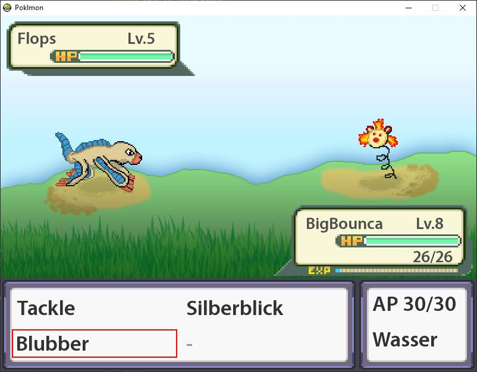
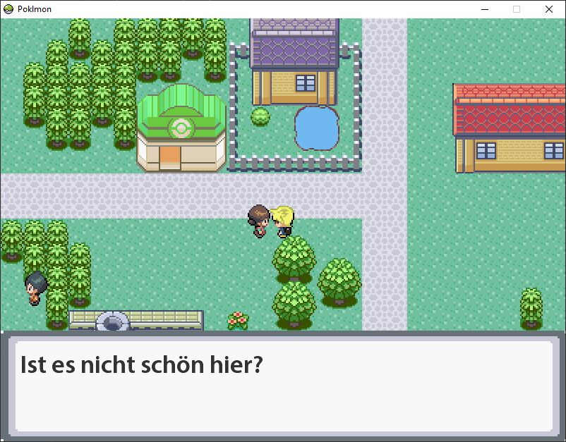
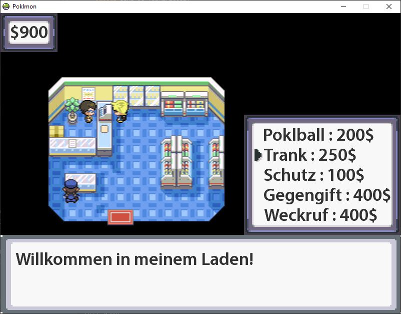
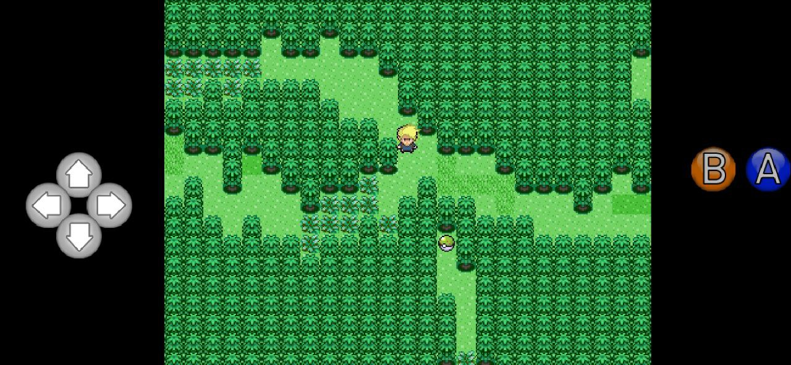
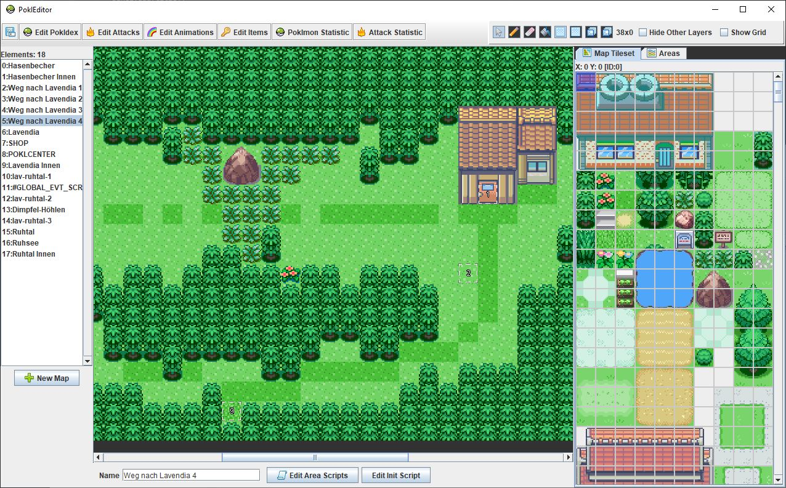

# Poklmon





- Reverse engineered Pokemon-Game
- Our own Poklmons, World and Story
- Some items and attacks taken over from the original games
- Using the same calculations and algorithms as Pokemon Ruby/Saphire edition
- Custom level editor to build the game content:
	* Creating all data-objects (Maps, Poklmons, Attacks, Animations and Items)	
	* Map objects and events 
	* Java-script support for implementing attack, item and event-scripts
	* Testing objects and the game

## Run Game on Desktop

```
gradlew runDesktop
```

## Run Game on Android



- An android device has to be connected in debugging mode
- minSdkVersion 14, targetSdkVersion 30

```
gradlew runAndroid
```

## Run Editor



```
gradlew runEditor
```
